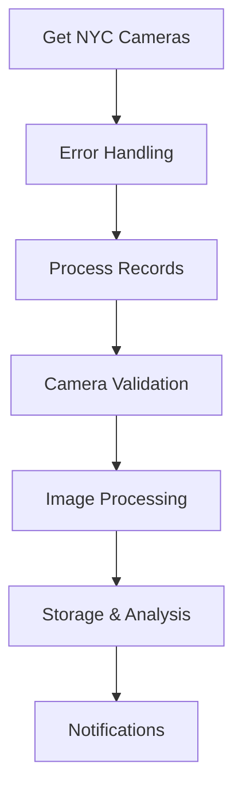
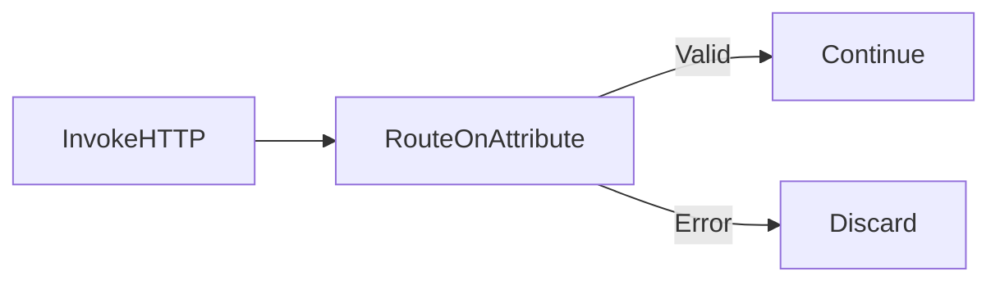
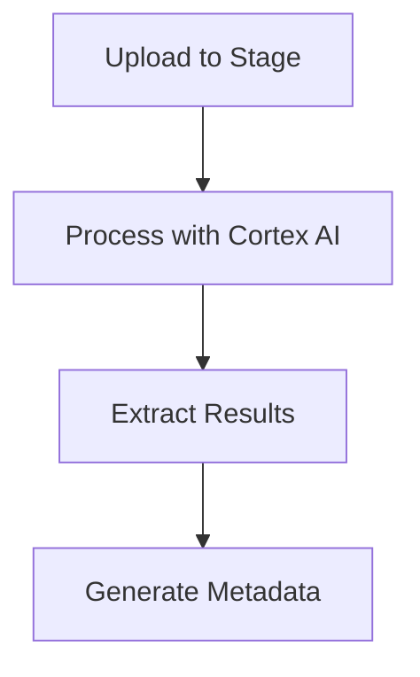

### TrafficAI

AI App for Traffic management in NYC with Apache NiFi, Cortex AI, Claude, LLM, Images, REST

### AI Pipeline

* Get the list of NYC Cameras: InvokeHTTP:   https://511ny.org/api/getcameras

* Through away error file:  RouteOnAttribute:  ${fileSize:gt( 4096 )}

* Split flowfiles into single records: SplitRecord:    JSONRead and Write
  
* EvaluateJsonPath: Extract some attributes
* Add randomness to URL calls:   UpdateAttribute:   ${random():mod(9996565656):plus(3)}
* Build new URL:   UpdateAttribute: ${url:append(${ending})}
* Throw away disabled cameras: RouteOnAttribute:  ${Blocked:equalsIgnoreCase("False"):and(${Disabled:equalsIgnoreCase("False")})}
* Call the new URL for each camera:   InvokeHTTP:  ${url2}
* Filter out dead images:   RouteOnAttribute:  ${Content-Length:le(15136)}
* Update filename: UpdateAttribute:  cam.${filename:append(${now():format('yyyyMMddHHmmSS'):append(${md5}):append('.jpg')})}
* Download image: PutFile
   - Send image to Slack:  PublishSlack
* Push to Snowflake Internal Stage:  ExecuteSQLRecord:  PUT file:///Users/tspann/Downloads/code/images/${filename:trim()} @TRAFFIC AUTO_COMPRESS=FALSE;
* Get to one record:  SplitRecord
* Get results of PUT to stage:   EvaluateJsonPath:   extract target and messages
* Call Cortex AI Stored Procedure on uploaded image:  ExecuteSQLRecord:  call DEMO.DEMO.ANALYZETRAFFICIMAGE('${pdffile}','${filename}','${uuid}');
* Split out multiple records into one at a time:  SplitRecord: JSON Read and Write
* Extract JSON from stored procedure: EvaluateJsonPath: $.ANALYZETRAFFICIMAGE
* Extract some values to attributes: EvaluateJsonPath:  $.traffic_conditions
* Build a new JSON file from all of our meta data:  AttributesToJSON:   videoid,videoname,videourl,filename,directionoftravel,latitude ,longitude,roadwayname,url2,ending,stagemessage,stagestatus,targetsize,uuid 
* Build a JSON Record: ExtractText:  (?s)(^.*$)
* Insert record to NYCTRAFFICIMAGES:  PutDatabaseRecord
* Send text and attachment to Slack. PublishSlack

  

### SQL

```

CREATE OR REPLACE PROCEDURE DEMO.DEMO.ANALYZETRAFFICIMAGE(IMAGE_NAME STRING)
RETURNS OBJECT
LANGUAGE SQL
EXECUTE AS OWNER
AS $$
DECLARE
  result VARIANT;
BEGIN
  ALTER STAGE TRAFFIC REFRESH; 
  
  SELECT SNOWFLAKE.CORTEX.COMPLETE('claude-3-5-sonnet', 
    'Analyze this traffic image and describe what you see. Respond in compact JSON format.',
    TO_FILE('@TRAFFIC', :IMAGE_NAME)) INTO :result;

   RETURN result;
END;
$$


CREATE OR REPLACE PROCEDURE count_vehicles_in_image(IMAGE_NAME STRING)
RETURNS OBJECT
LANGUAGE SQL
AS
$$
DECLARE
    result VARIANT;
BEGIN
-- Use claude-3-5-sonnet model for image analysis with structured output
ALTER STAGE TRAFFIC REFRESH; 

SELECT SNOWFLAKE.CORTEX.COMPLETE('claude-3-5-sonnet','Analyze this traffic image and count the number of vehicles. Return the result in JSON format with these fields: total_count (number), vehicle_types (array of strings with vehicle categories), confidence_level (string: high, medium, or low). Only include clearly visible vehicles.',TO_FILE('@Traffic', :IMAGE_NAME)) INTO :result;

RETURN result;

END;
$$

alter stage traffic refresh;

LIST  @traffic;


CREATE OR REPLACE TABLE DEMO.DEMO.NYCTRAFFIC (
  "ID" text,
  speed text,
  travel_time text,
  status text,
  data_as_of text,
  link_id text,
  link_points text,
  encoded_poly_line text,
  encoded_poly_line_lvls text,
  "OWNER" text,
  transcom_id text,
  borough text,
  link_name text,
  "TS" text,
  uuid text
);


  
  
describe table demo.demo.nyctraffic;

select * from nyctraffic;

CREATE OR REPLACE PROCEDURE insert_json_data(JSON_STRING STRING)
RETURNS STRING
LANGUAGE SQL
AS
$$
DECLARE
    result STRING;
BEGIN   
    INSERT INTO RAWNYCTRAFFICIMAGES (json_data)
    SELECT PARSE_JSON(:JSON_STRING);

    RETURN 'JSON data inserted successfully';
EXCEPTION   
WHEN OTHER THEN
    RETURN 'Error inserting JSON: ' || SQLSTATE || ' - ' || SQLERRM;
END;
$$;


CREATE OR REPLACE TABLE DEMO.DEMO.NYCTRAFFICIMAGES (
  videoid text,
  videoname text,
  videourl text,
  filename text,
  directionoftravel text,
  latitude text,
  longitude text,
  roadwayname text,
  url2 text,
  ending text,
  stagemessage text,
  stagestatus text,
  targetsize text,
  uuid text
);


CREATE OR REPLACE TABLE DEMO.DEMO.RAWNYCTRAFFICIMAGES 
(
    uuid text,
    filename text,
    json_data VARIANT
);


CREATE OR REPLACE PROCEDURE DEMO.DEMO.ANALYZETRAFFICIMAGE("IMAGE_NAME" STRING, "UUID" STRING)
RETURNS OBJECT
LANGUAGE SQL
EXECUTE AS OWNER
AS $$
DECLARE
  result VARIANT;
BEGIN
   ALTER STAGE TRAFFIC REFRESH; 
  
   SELECT SNOWFLAKE.CORTEX.COMPLETE('claude-3-5-sonnet', 
    'Analyze this traffic image and describe what you see. Respond in compact JSON format.',
    TO_FILE('@TRAFFIC', :IMAGE_NAME)) INTO :result;

   INSERT INTO DEMO.DEMO.RAWNYCTRAFFICIMAGES 
   (json_data, filename, uuid)
   SELECT PARSE_JSON(:result ) as json_data, :IMAGE_NAME, :UUID;
    
   RETURN result;
EXCEPTION
    WHEN OTHER THEN
        RETURN 'Error: ' || SQLSTATE || ' - '|| SQLERRM;   
END;
$$;


SELECT n.*,
       r.json_data,
       JSON_DATA:direction::STRING as direction,
       JSON_DATA:environment.surroundings::ARRAY as surroundings,
       JSON_DATA:environment.visibility::STRING as visibility,
       JSON_DATA:environment.weather::STRING as weather,
       JSON_DATA:image_quality::STRING as image_quality,
       JSON_DATA:location::STRING as location,
       JSON_DATA:road_features.bike_lane::STRING as bike_lane,
       JSON_DATA:road_features.lanes::STRING as lanes,
       JSON_DATA:road_features.markings::ARRAY as road_markings,
       JSON_DATA:road_features.traffic_signals::STRING as traffic_signals,
       JSON_DATA:timestamp::STRING as traffictimestamp,
       JSON_DATA:traffic_conditions::STRING as traffic_conditions
FROM DEMO.DEMO.NYCTRAFFICIMAGES n
LEFT JOIN DEMO.DEMO.RAWNYCTRAFFICIMAGES r
ON n.filename = r.filename;


```

### Cortex AI SQL

````

CREATE OR REPLACE PROCEDURE DEMO.DEMO.COUNTVEHICLES(IMAGE_NAME STRING)
RETURNS INTEGER
LANGUAGE SQL
EXECUTE AS OWNER
AS $$
DECLARE
  resultcount INTEGER;
BEGIN
  ALTER STAGE TRAFFIC REFRESH; 
  
  SELECT SNOWFLAKE.CORTEX.COMPLETE('pixtral-large', 'Return a count the number of distinct vehicles in this image.Some of the vehicles may appear small. Pay particular attention to the vehicles in the upper part of the image.Do not provide any other details. Do not provide any other words or commentary.',
    TO_FILE('@TRAFFIC', :IMAGE_NAME)))  INTO :resultcount;
   RETURN resultcount;
END;
$$


SELECT SNOWFLAKE.CORTEX.COMPLETE('claude-3-5-sonnet',PROMPT('Compare these two traffic camera images {0} {1}',TO_FILE('@Traffic','NoLiveCamera.jpg'),
TO_FILE('@Traffic','cam.path.0a9f1346-5f4a-424c-bdac-3fd6c16e099920250529094328.jpg20250529115868.jpg')));


The first image shows an error message indicating "No live camera feed at this time" with an exclamation mark icon. The second image shows an active traffic camera view of an urban street scene, labeled as "Facing North" with a timestamp of Thu May 29 2025 11:32:50 AM. The active camera captures a typical city street with vehicles, buildings on both sides, trees lining the street, and what appears to be a bike lane or bus lane marked in red. The image quality is typical of traffic cameras, with a somewhat grainy, monochromatic appearance.


````


#### Advanced Query

````


WITH traffic_data AS (
    SELECT n.*,
           r.json_data,
           JSON_DATA:direction::STRING as direction,
           JSON_DATA:environment.surroundings::ARRAY as surroundings,
           JSON_DATA:environment.visibility::STRING as visibility,
           JSON_DATA:environment.weather::STRING as weather,
           JSON_DATA:image_quality::STRING as image_quality,
           JSON_DATA:location::STRING as location,
           JSON_DATA:road_features.bike_lane::STRING as bike_lane,
           JSON_DATA:road_features.lanes::STRING as lanes,
           JSON_DATA:road_features.markings::ARRAY as road_markings,
           JSON_DATA:road_features.traffic_signals::STRING as traffic_signals,
           JSON_DATA:timestamp::STRING as traffictimestamp,
           JSON_DATA:traffic_conditions::STRING as traffic_conditions,
           n.latitude as traffic_lat,
           n.longitude as traffic_long
    FROM DEMO.DEMO.NYCTRAFFICIMAGES n
    LEFT OUTER JOIN DEMO.DEMO.RAWNYCTRAFFICIMAGES r
    ON n.filename = r.filename
)
SELECT 
    t.*,
    a.number || ' ' || a.street || ' ' || a.street_type as street_address,
    a.city,
    a.state,
    a.zip,
    a.latitude as address_lat,
    a.longitude as address_long,
    ST_DISTANCE(
        ST_MAKEPOINT(t.traffic_long, t.traffic_lat),
        ST_MAKEPOINT(a.longitude, a.latitude)
    ) as distance_in_meters
FROM traffic_data t
LEFT OUTER JOIN US_REAL_ESTATE.CYBERSYN.US_ADDRESSES a
ON a.state = 'NY' 
AND ST_DISTANCE(
    ST_MAKEPOINT(t.traffic_long, t.traffic_lat),
    ST_MAKEPOINT(a.longitude, a.latitude)
) <= 100
QUALIFY ROW_NUMBER() OVER (
    PARTITION BY t.filename 
   ORDER BY ST_DISTANCE(
        ST_MAKEPOINT(t.traffic_long, t.traffic_lat),
        ST_MAKEPOINT(a.longitude, a.latitude)
    )
) = 1;


````


Here's an article about the NiFi data flow for processing NYC traffic camera images:

# Automated NYC Traffic Camera Processing with Apache NiFi

This article details an automated workflow using Apache NiFi to collect, process, and analyze traffic camera images from New York City's network of cameras.

## System Overview



## Detailed Workflow

### 1. Data Acquisition
The process begins with an `InvokeHTTP` processor fetching the list of NYC traffic cameras. 



### 2. Record Processing
The data stream is then processed through several steps:

- `SplitRecord`: Separates camera listings into individual records
- `EvaluateJsonPath`: Extracts relevant attributes
- `UpdateAttribute`: Adds randomization for API calls

### 3. Camera Processing Pipeline

```
┌────────────────┐
│ UpdateAttribute│
│ (Build URL)    │
└───────┬────────┘
        ▼
┌────────────────┐
│RouteOnAttribute│
│(Filter Cameras)│
└───────┬────────┘
        ▼
┌────────────────┐
│  InvokeHTTP    │
│(Fetch Images)  │
└────────────────┘
```

### 4. Storage and Analysis

The workflow incorporates multiple storage and analysis steps:

1. Local Storage:
   - `UpdateAttribute`: Generate filenames
   - `PutFile`: Save images locally

2. Cloud Storage:
   - `PublishSlack`: Share to Slack
   - `ExecuteSQLRecord`: Upload to Snowflake

3. AI Analysis:


### 5. Data Integration

The final steps involve:

- `AttributesToJSON`: Consolidate metadata
- `ExtractText`: Format JSON records
- `PutDatabaseRecord`: Store in NYCTRAFFICIMAGES
- `PublishSlack`: Send notifications

## Technical Implementation Details

```json
{
  "workflow_components": {
    "data_acquisition": {
      "primary": "InvokeHTTP",
      "error_handling": "RouteOnAttribute"
    },
    "processing": {
      "record_splitting": "SplitRecord",
      "attribute_extraction": "EvaluateJsonPath"
    },
    "storage": {
      "local": "PutFile",
      "cloud": "ExecuteSQLRecord"
    }
  }
}
```

## Monitoring and Alerts

The system includes comprehensive monitoring through Slack notifications:

📊 **Alert Types**:
- Image acquisition status
- Processing completion
- AI analysis results
- Error notifications

This automated pipeline ensures efficient processing of NYC traffic camera data while maintaining robust error handling and notification systems.


##  Automating NYC Traffic Camera Image Capture and Analysis with NiFi

This article outlines a robust NiFi data pipeline designed to capture images from NYC traffic cameras, perform analysis, and disseminate insights. We'll explore each step of the process, highlighting the NiFi processors used and their roles in creating a seamless and intelligent data flow.

### The Challenge: Harnessing Real-time Traffic Visuals

New York City's traffic cameras provide a rich, real-time visual feed of urban mobility. However, extracting, processing, and leveraging this data for insights requires a sophisticated and automated system. Our NiFi pipeline addresses this by orchestrating the entire lifecycle, from fetching raw camera feeds to pushing processed images and metadata to analytical platforms and communication channels.

### The NiFi Workflow: A Step-by-Step Breakdown

Let's dive into the individual components of this NiFi flow.

#### 1. Obtaining the NYC Camera List

**Action:** Get the list of NYC Cameras
**NiFi Processor:** InvokeHTTP

The journey begins with fetching the initial list of NYC traffic cameras. The `InvokeHTTP` processor is perfectly suited for this, allowing us to make an HTTP GET request to the NYC camera API endpoint and retrieve the raw camera metadata, likely in JSON format.

#### 2. Handling Errors

**Action:** Through away error file
**NiFi Processor:** RouteOnAttribute

Robust data pipelines must gracefully handle errors. The `RouteOnAttribute` processor plays a crucial role here. It examines the attributes of incoming FlowFiles (NiFi's data representation unit). If an error occurs during the API call (e.g., a camera is offline), `RouteOnAttribute` can route the error FlowFile to a separate path for logging or further investigation, ensuring that the main flow isn't disrupted.

#### 3. Preparing Data for Processing

**Action:** Split flowfiles into single records
**NiFi Processor:** SplitRecord

The initial API response likely contains a list of camera records. To process each camera individually, we use `SplitRecord`. This processor divides the incoming FlowFile (containing the entire list) into multiple FlowFiles, each representing a single camera's data.

#### 4. Extracting Relevant Information

**Action:** Extract some attributes
**NiFi Processor:** EvaluateJsonPath

The camera data likely contains more information than we need. `EvaluateJsonPath` allows us to extract specific attributes from the JSON data, such as the camera's ID, URL, and status. This makes subsequent processing steps more efficient.

#### 5 & 6. Building Dynamic URLs

**Action:** Add randomness to URL calls & Build new URL
**NiFi Processor:** UpdateAttribute (used twice)

To avoid overloading the camera API and ensure we get fresh images, we can add a bit of randomness to the URL calls. `UpdateAttribute` is the workhorse for manipulating FlowFile attributes. In the first instance, it might add a random query parameter (e.g., a timestamp) to the URL. In the second instance, it constructs the complete URL for fetching the camera image, potentially combining the base URL with the camera ID extracted earlier.

#### 7. Filtering Unusable Data

**Action:** Throw away disabled cameras
**NiFi Processor:** RouteOnAttribute

Similar to error handling, we might need to filter out cameras that are temporarily disabled or offline. `RouteOnAttribute` again comes into play, examining the camera status attribute and routing FlowFiles for disabled cameras to a separate path.

#### 8. Fetching the Images

**Action:** Call the new URL for each camera
**NiFi Processor:** InvokeHTTP

Now that we have the correct URLs, `InvokeHTTP` is used again, this time to fetch the actual image data from each camera.

#### 9. Image Quality Check (Implicit)

**Action:** Filter out dead images

This step isn't tied to a specific NiFi processor in the list, but it's crucial. You'd likely use a combination of processors: perhaps `EvaluateJsonPath` to extract image metadata (if available from the API) and `RouteOnAttribute` to filter out images that are reported as corrupted or unavailable. You might also use a custom script in a `ExecuteStreamCommand` processor to perform an actual image analysis to check for validity.

#### 10 & 11. Preparing Images for Storage

**Action:** Update filename & Download image
**NiFi Processor:** UpdateAttribute & PutFile

Before saving the images, we'll want to give them meaningful filenames. `UpdateAttribute` is used to create a filename based on the camera ID and timestamp. Then, `PutFile` saves the image to a designated directory.

#### 12. Sharing Images

**Action:** Send image to Slack
**NiFi Processor:** PublishSlack

For real-time monitoring, we can send images directly to a Slack channel using `PublishSlack`. This allows for immediate visual inspection of traffic conditions.

#### 13 - 19. Data Integration and Analysis

These steps focus on pushing data to Snowflake, performing AI analysis, and extracting insights.

* **Push to Snowflake Internal Stage: ExecuteSQLRecord** - Loads image metadata into Snowflake.
* **Get to one record: SplitRecord** - Prepares data for AI processing.
* **Get results of PUT to stage: EvaluateJsonPath** - Extracts relevant information from the Snowflake load results.
* **Call Cortex AI Stored Procedure on uploaded image: ExecuteSQLRecord** - Triggers AI analysis (e.g., object detection, traffic density analysis).
* **Split out multiple records into one at a time: SplitRecord** - Handles results that may contain multiple objects detected in the image.
* **Extract JSON from stored procedure: EvaluateJsonPath** - Parses the JSON output from the AI procedure.
* **Extract some values to attributes: EvaluateJsonPath** - Extracts specific attributes from the AI results (e.g., number of cars, detected objects).

#### 20 - 23. Building and Storing Metadata

* **Build a new JSON file from all of our meta data: AttributesToJSON** - Creates a comprehensive JSON file containing all extracted metadata.
* **Build a JSON Record: ExtractText** - Constructs a JSON record.
* **Insert record to NYCTRAFFICIMAGES: PutDatabaseRecord** - Inserts the final record into a database table.
* **Send text and attachment to Slack: PublishSlack** - Sends the processed metadata and possibly the analyzed image to a Slack channel.

### Conclusion

This NiFi pipeline provides a powerful and flexible solution for automatically capturing, processing, analyzing, and disseminating information from NYC traffic cameras. The modular nature of NiFi allows for easy modification and extension of this workflow to meet evolving needs.


### Step-by-Step Diagram


This diagram illustrates the detailed flow of data through the NiFi workflow, starting with image capture and progressing through various processing steps to data storage and notification. It shows the individual NiFi processors involved and how they connect to perform the required actions.

### High-Level Diagram


This diagram provides a broader overview of the NiFi workflow, highlighting the major stages of data processing, from initial image capture to final data storage and notification. It simplifies the process, focusing on the key phases and data transformations involved.

Would you like any further adjustments or more details on these diagrams?


### Resources

* https://docs.snowflake.com/en/user-guide/snowflake-cortex/complete-multimodal
* https://docs.snowflake.com/en/sql-reference/functions/prompt


### List of Steps

* Get the list of NYC Cameras: InvokeHTTP
* Through away error file:  RouteOnAttribute
* Split flowfiles into single records: SplitRecord
* Extract some attributes:  EvaluateJsonPath
* Add randomness to URL calls:   UpdateAttribute
* Build new URL:   UpdateAttribute
* Throw away disabled cameras: RouteOnAttribute:
* Call the new URL for each camera:   InvokeHTTP
* Filter out dead images
* Update filename: UpdateAttribute
* Download image: PutFile
* Send image to Slack:  PublishSlack
* Push to Snowflake Internal Stage:  ExecuteSQLRecord
* Get to one record:  SplitRecord
* Get results of PUT to stage:   EvaluateJsonPath
* Call Cortex AI Stored Procedure on uploaded image:  ExecuteSQLRecord
* Split out multiple records into one at a time:  SplitRecord
* Extract JSON from stored procedure: EvaluateJsonPath
* Extract some values to attributes: EvaluateJsonPath
* Build a new JSON file from all of our meta data:  AttributesToJSON
* Build a JSON Record: ExtractText
* Insert record to NYCTRAFFICIMAGES:  PutDatabaseRecord
* Send text and attachment to Slack. PublishSlack

  
